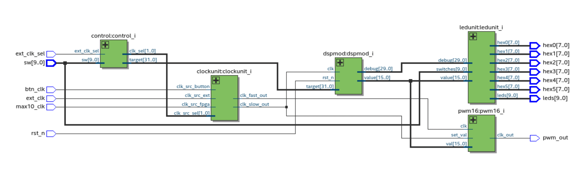

# anspwm

Periodically updated pwm generator

## design
This is a hierarchical design with five top level entities

### control
Uses DE10-Lite switches to select what data to display in the LED
module and what clock to use.

### clockunit
Contains clock dividers and a clock multiplexer.

### dsp unit
Four stages each consisting of a quantize step, and zero or more delayed difference
modules followed by zero or more clock delays.

### pwm module
Generate a PWM signal

### LED control
Outputs values selected for display to seven segment displays.
